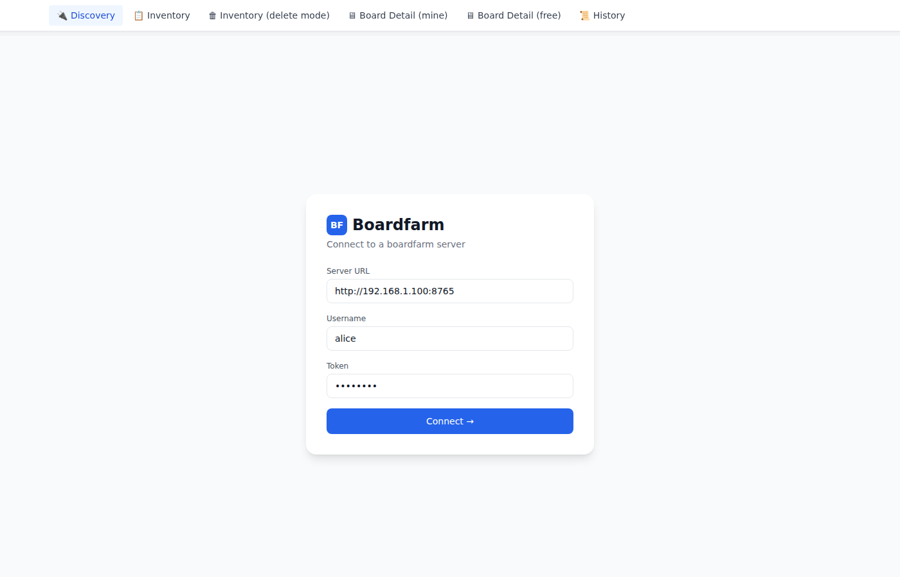
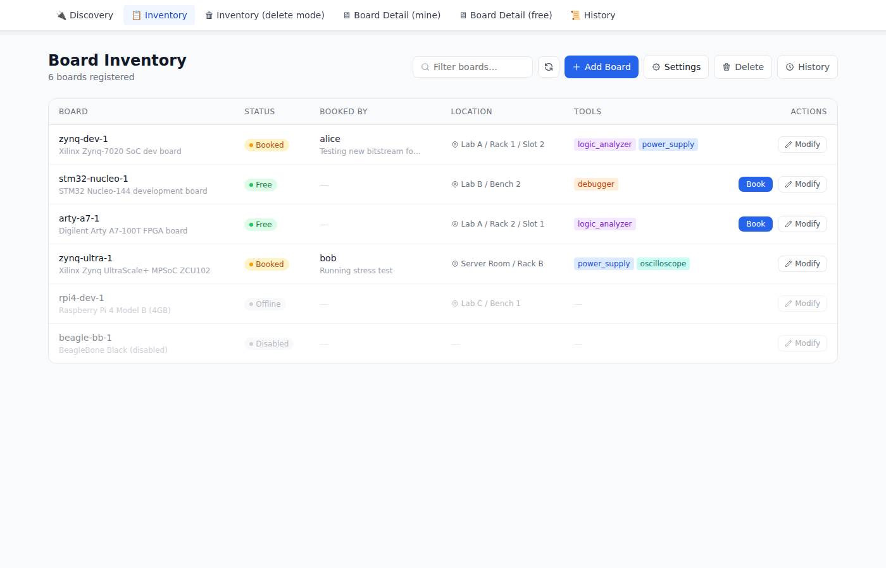
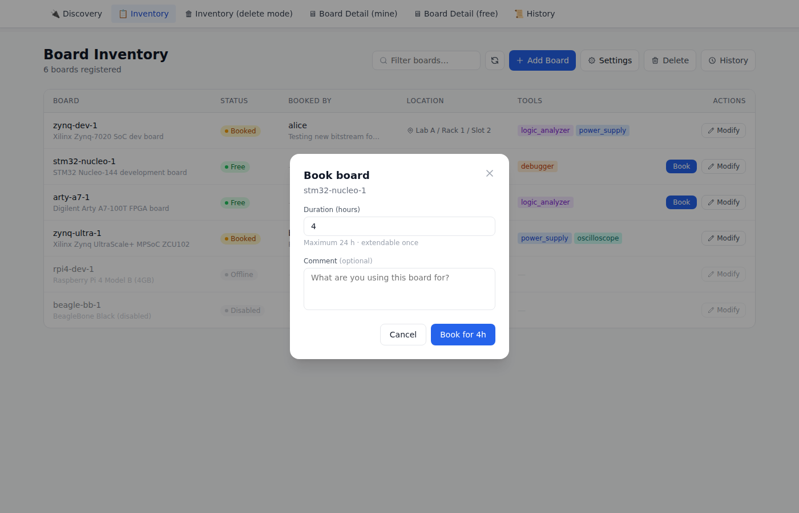
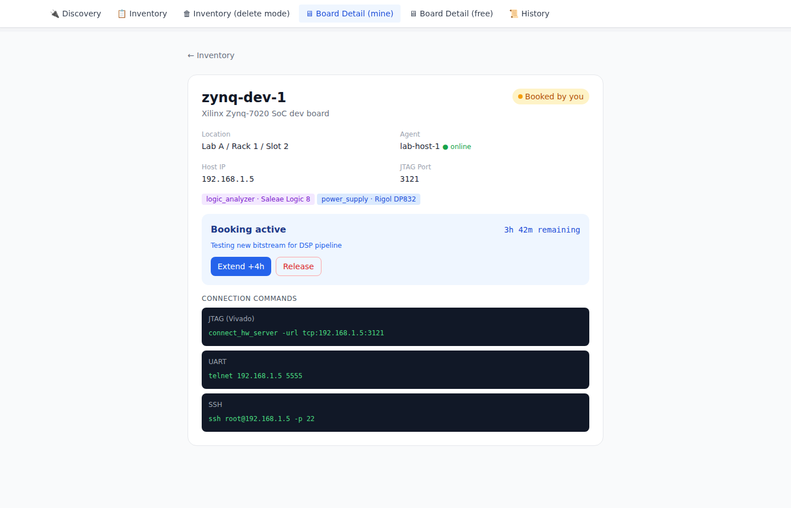
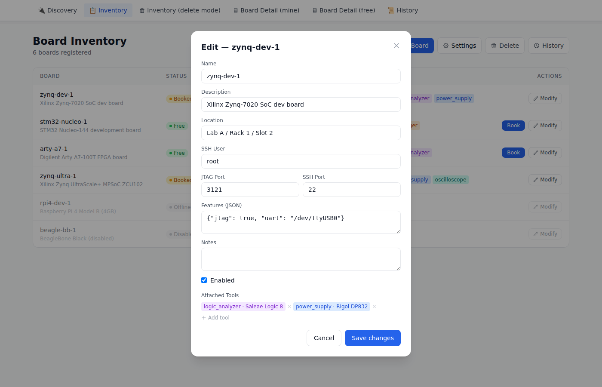
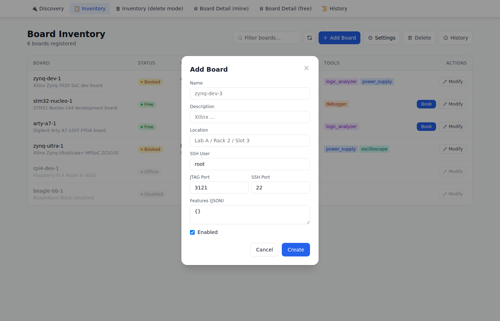
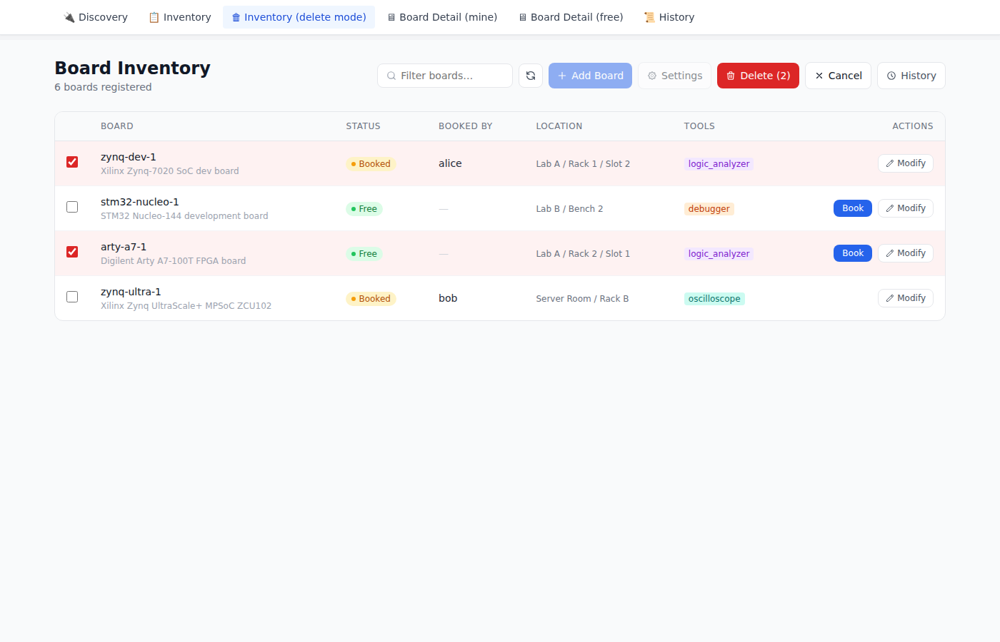
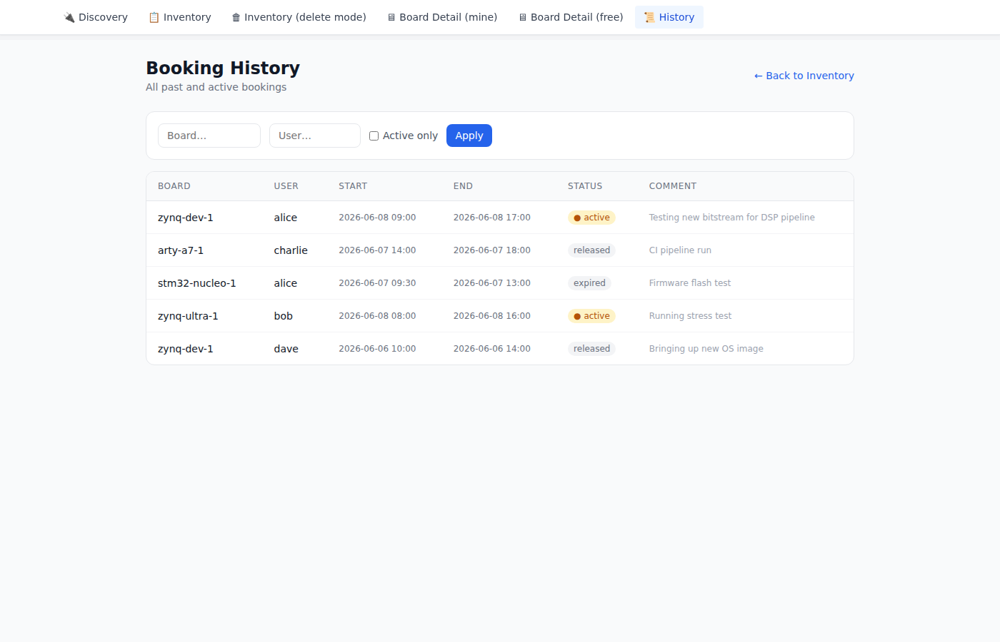

# Boardfarm

A development board booking system for shared hardware labs.

## Architecture

```
┌─────────────┐     REST/HTTP      ┌───────────────────────────┐
│  Frontend   │ ─────────────────> │  Server (central)         │
│ (React SPA) │                    │  - Board inventory        │
└─────────────┘                    │  - Booking history        │
                                   │  - Agent registry         │
                                   └───────────┬───────────────┘
                                               │ REST/HTTP
                                    ┌──────────┴──────────┐
                                    │  Agent(s)           │
                                    │  (per board-host PC)│
                                    │  - hw_server JTAG   │
                                    │  - socat UART proxy │
                                    │  - Power control    │
                                    └─────────────────────┘
```

## Components

| Directory | Description |
|-----------|-------------|
| `server/` | Central inventory & booking API (FastAPI, SQLite) |
| `agent/`  | Hardware agent per board-host PC (FastAPI + mDNS) |
| `power/`  | Power control scripts (USB relay, GPIO, dummy) |
| `frontend/` | React + Vite SPA |

---

## Quick Start

### 1. Server

```bash
cd server
pip install -r requirements.txt
cp config.example.yaml config.yaml
# Edit config.yaml: set a strong token
uvicorn server.main:app --port 8765
```

### 2. Add boards to inventory

```bash
curl -X POST http://localhost:8765/boards \
  -H "X-Token: changeme" -H "X-User: admin" \
  -H "Content-Type: application/json" \
  -d '{
    "name": "zynq-dev-1",
    "description": "Xilinx Zynq 7020",
    "location": "Lab A / Rack 3 / Slot 1",
    "features": {"jtag": true, "uart": "/dev/ttyUSB0", "network": "eth0"},
    "jtag_port": 3121,
    "uart_tcp_port": 5555,
    "ssh_user": "root",
    "ssh_port": 22
  }'
# Note the returned board "id"
```

### 3. Agent (on the host PC connected to boards)

```bash
cd agent
pip install -r requirements.txt
cp config.example.yaml config.yaml
# Edit config.yaml:
#   - Set server_url to your server address
#   - Set server_token to match the server token
#   - Set host_ip to this machine's LAN IP
#   - Set board IDs to match what you registered in the server
uvicorn agent.main:app --port 8766
```

### 4. Frontend

```bash
cd frontend
npm install
npm run dev
# Open http://localhost:5173
# Enter server URL, username, and token
```

---

## Agent Config (`agent/config.yaml`)

```yaml
agent:
  name: "lab-host-1"
  port: 8766
  server_url: "http://192.168.1.100:8765"
  server_token: "changeme"
  host_ip: "192.168.1.5"   # this machine's LAN IP

boards:
  - id: "paste-board-uuid-here"
    uart_device: "/dev/ttyUSB0"
    uart_baud: 115200
    jtag_port: 3121
    uart_tcp_port: 5555
    power_script: "../power/usb_relay.py"
    power_args:
      relay_id: 1
```

---

## Power Control Scripts

Scripts in `power/` follow a common CLI: `python3 script.py --action on|off|reset`.

| Script | Hardware |
|--------|----------|
| `dummy.py` | No-op (testing) |
| `usb_relay.py` | USB HID relay board (`--relay-id N`) |
| `gpio.py` | Raspberry Pi GPIO (`--gpio-pin N`) |

Custom controllers: subclass `power.base.PowerController` and call `run_controller()`.

---

## Using the Frontend

### Connect to a server

Open `http://localhost:5173`, enter the server URL, your username, and the shared token, then click **Connect**.



---

### Browse the inventory

The main page lists every registered board in a table. Each row shows:

- **Status** — Free (green), Booked (amber), Offline/Disabled (grey)
- **Booked by** — current holder's username + booking comment
- **Location** — physical rack/bench location
- **Tools** — colour-coded badges for attached hardware (logic analyzer, power supply, …)
- **Actions** — **Book** button for free boards, **Modify** to edit any board



Use the **Filter** box in the header to search by board name, location, user, or tool type. Results update instantly.

---

### Book a board

Click **Book** on any free board's row. A modal opens where you set the duration (1–24 hours) and an optional comment describing your intended use. Click **Book for Nh** to confirm.



Once booked, navigate to the board's detail page to get the connection commands (JTAG, UART, SSH).



---

### Manage boards

Click **Modify** on any row to open the edit modal. You can update the board's name, location, ports, features JSON, notes, and attached tools (add or remove) — all without leaving the inventory page.



To add a new board, click **Add Board** in the header. A compact form overlays the current view.



---

### Delete boards

Click **Delete** in the header to enter delete mode. Checkboxes appear on each row — select the boards you want to remove, then click **Delete (N)** to confirm. Click **Cancel** to exit without deleting.



---

### Booking history

Click **History** to navigate to the history page. You can filter by board name, username, or active-only bookings. Each row shows the start/end time, release reason, and the booking comment.



---

## API Reference

### Server (`http://server:8765`)

All endpoints (except `/health`) require headers:
- `X-Token: <token>`
- `X-User: <username>`

| Method | Path | Description |
|--------|------|-------------|
| GET | `/health` | Liveness check |
| GET | `/boards` | List all boards |
| POST | `/boards` | Add board to inventory |
| PATCH | `/boards/{id}` | Update board |
| DELETE | `/boards/{id}` | Remove board |
| GET | `/boards/{id}/tools` | List tools |
| POST | `/boards/{id}/tools` | Add tool |
| DELETE | `/tools/{id}` | Remove tool |
| POST | `/boards/{id}/book` | Book board |
| DELETE | `/bookings/{id}` | Release booking |
| PATCH | `/bookings/{id}/extend` | Extend booking |
| GET | `/bookings/{id}/commands` | Get connection commands |
| GET | `/bookings` | Booking history |
| GET | `/agents` | List registered agents |

### Agent (`http://agent:8766`)

| Method | Path | Description |
|--------|------|-------------|
| GET | `/health` | Liveness + board list |
| GET | `/agents` | Self + mDNS-discovered peers |
| POST | `/boards/{id}/services/start` | Start hw_server + UART proxy |
| POST | `/boards/{id}/services/stop` | Stop services |
| POST | `/boards/{id}/power` | Power action |
