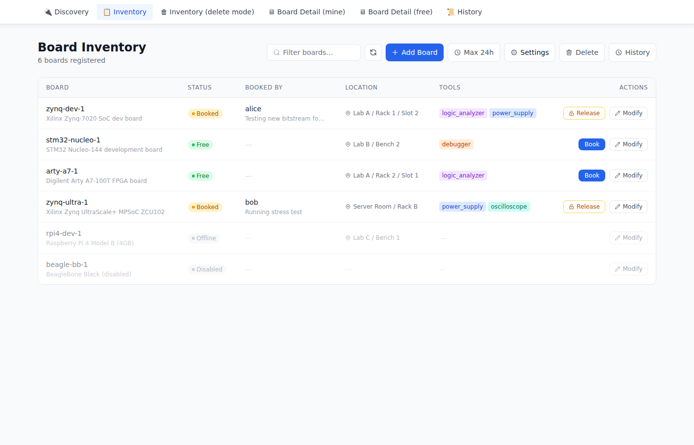
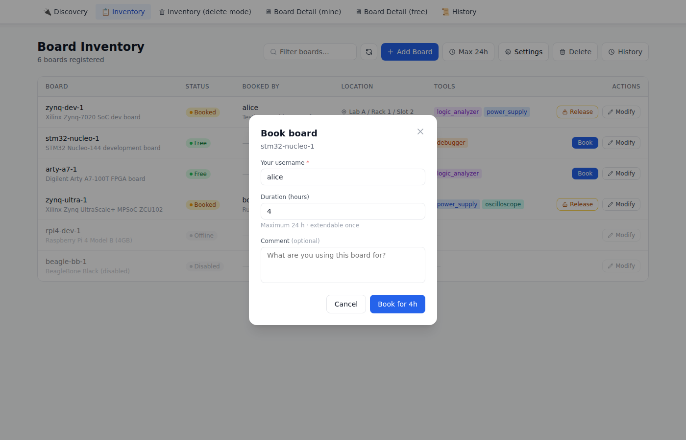
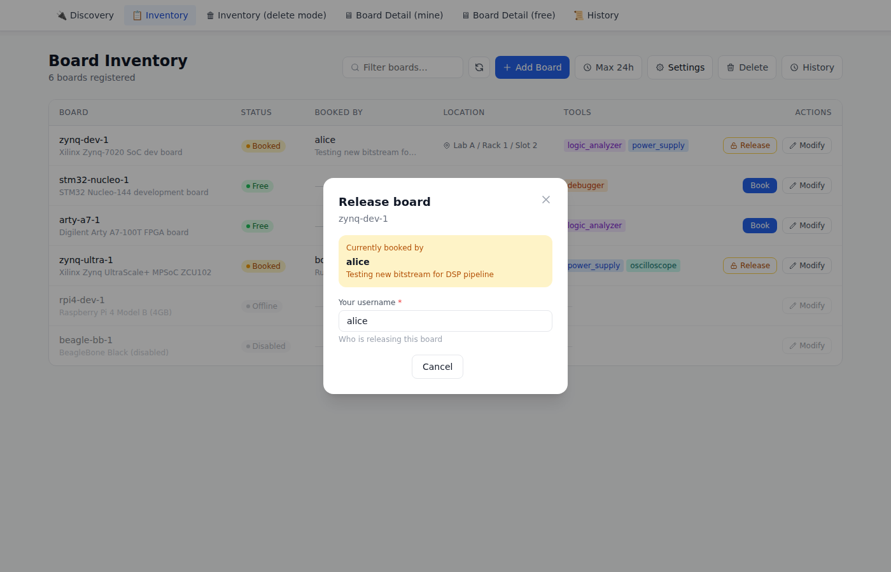
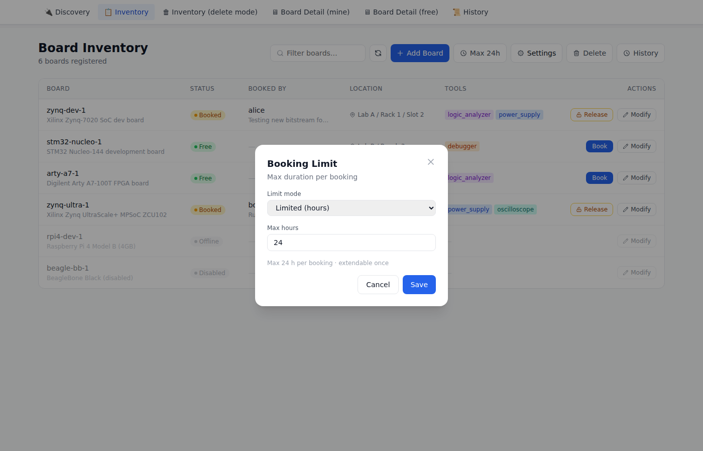
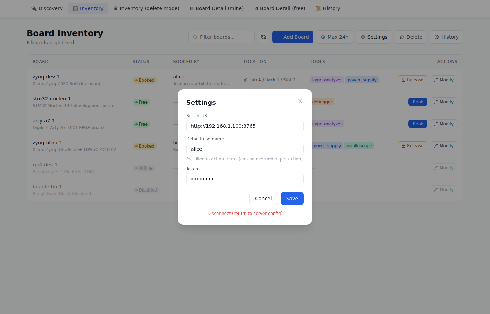
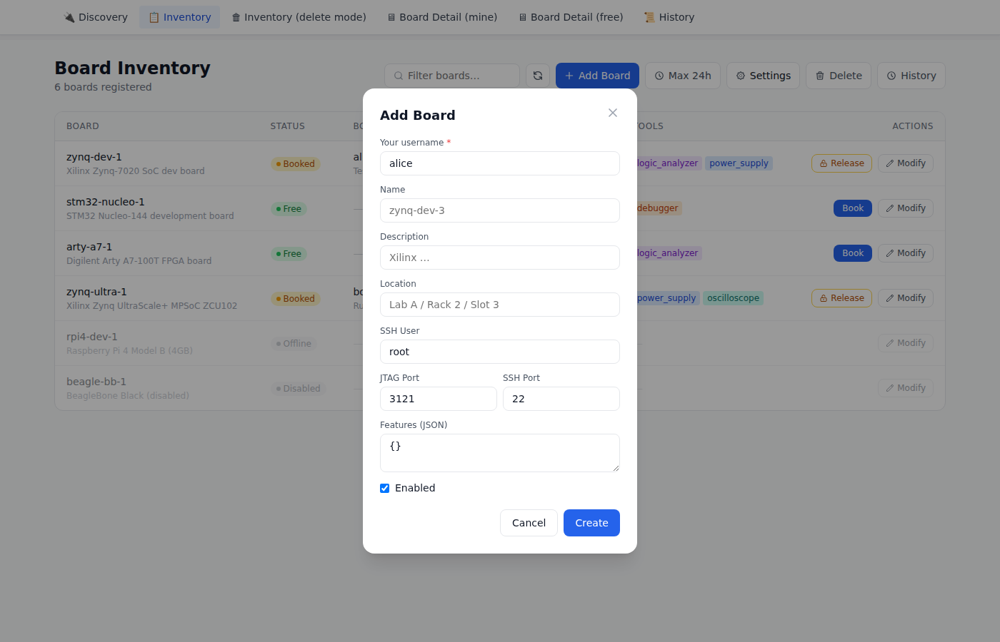

# Boardfarm

A development board booking system for shared hardware labs.

## Architecture

```
┌─────────────┐     REST/HTTP      ┌───────────────────────────┐
│  Frontend   │ ─────────────────> │  Server (central)         │
│ (React SPA) │                    │  - Board inventory        │
└─────────────┘                    │  - Booking history        │
                                   │  - Agent registry         │
                                   └───────────┬───────────────┘
                                               │ REST/HTTP
                                    ┌──────────┴──────────┐
                                    │  Agent(s)           │
                                    │  (per board-host PC)│
                                    │  - hw_server JTAG   │
                                    │  - socat UART proxy │
                                    │  - Power control    │
                                    └─────────────────────┘
```

## Components

| Directory | Description |
|-----------|-------------|
| `server/` | Central inventory & booking API (FastAPI, SQLite) |
| `agent/`  | Hardware agent per board-host PC (FastAPI + mDNS) |
| `power/`  | Power control scripts (USB relay, GPIO, dummy) |
| `frontend/` | React + Vite SPA |

---

## Quick Start

### Docker Compose (recommended)

The fastest way to run the server and frontend together — no Node.js or Python required on the host:

**1. Configure the server**

```bash
cp server/config.example.yaml server/config.yaml
# Edit server/config.yaml — at minimum change the token:
#   token: "your-strong-secret"
```

**2. Start the stack**

```bash
docker compose up --build
```

Docker builds both images from source and starts two containers:

| Container  | Port | Description |
|------------|------|-------------|
| `server`   | 8765 | FastAPI booking API |
| `frontend` | 80   | Nginx serving the React SPA (built inside Docker) |

The SQLite database is stored in a named volume (`boardfarm_data`) so it persists across restarts.

**3. Open the UI**

```
http://localhost
```

Enter `http://localhost:8765` as the server URL, the token from your config, and you're in.

**Useful commands**

```bash
# Run in background
docker compose up -d --build

# View logs
docker compose logs -f server
docker compose logs -f frontend

# Stop
docker compose down

# Destroy everything including the database volume
docker compose down -v
```

---

### Running the agent separately

The agent runs on the **host PC that is physically wired to the boards** — not in Docker (it needs direct access to USB/serial devices and optionally Xilinx `hw_server`). Run it natively on that machine:

```bash
cd agent
pip install -r requirements.txt
cp config.example.yaml config.yaml
# Edit config.yaml: set server_url, server_token, host_ip, and board IDs
uvicorn agent.main:app --port 8766
```

If you do want to containerise the agent, the `agent/Dockerfile` is provided. Pass the device into the container with `--device`:

```bash
docker build -t boardfarm-agent -f agent/Dockerfile .
docker run --device /dev/ttyUSB0 \
  -v ./agent/config.yaml:/app/config.yaml:ro \
  -p 8766:8766 boardfarm-agent
```

---

### Manual Quick Start (without Docker)

#### 1. Server

```bash
cd server
pip install -r requirements.txt
cp config.example.yaml config.yaml
# Edit config.yaml: set a strong token, adjust max_booking_hours if needed
uvicorn server.main:app --port 8765
```

Key `config.yaml` options:

```yaml
server:
  token: "changeme"          # shared secret — set this
  max_booking_hours: 24      # booking cap: N=hours, null=unlimited, 0=never expires
  default_user: null         # pre-fill this username in the UI (null = no default)
  admin_users: ["admin"]     # users allowed to modify/delete boards
```

#### 2. Add boards to inventory

```bash
curl -X POST http://localhost:8765/boards \
  -H "X-Token: changeme" -H "X-User: admin" \
  -H "Content-Type: application/json" \
  -d '{
    "name": "zynq-dev-1",
    "description": "Xilinx Zynq 7020",
    "location": "Lab A / Rack 3 / Slot 1",
    "features": {"jtag": true, "uart": "/dev/ttyUSB0", "network": "eth0"},
    "jtag_port": 3121,
    "uart_tcp_port": 5555,
    "ssh_user": "root",
    "ssh_port": 22
  }'
# Note the returned board "id"
```

#### 3. Agent (on the host PC connected to boards)

```bash
cd agent
pip install -r requirements.txt
cp config.example.yaml config.yaml
# Edit config.yaml:
#   - Set server_url to your server address
#   - Set server_token to match the server token
#   - Set host_ip to this machine's LAN IP
#   - Set board IDs to match what you registered in the server
uvicorn agent.main:app --port 8766
```

#### 4. Frontend (dev server)

```bash
cd frontend
npm install
npm run dev
# Open http://localhost:5173 and enter the server URL and token
```

---

## Agent Config (`agent/config.yaml`)

```yaml
agent:
  name: "lab-host-1"
  port: 8766
  server_url: "http://192.168.1.100:8765"
  server_token: "changeme"
  host_ip: "192.168.1.5"   # this machine's LAN IP

boards:
  - id: "paste-board-uuid-here"
    uart_device: "/dev/ttyUSB0"
    uart_baud: 115200
    jtag_port: 3121
    uart_tcp_port: 5555
    power_script: "../power/usb_relay.py"
    power_args:
      relay_id: 1
```

---

## Power Control Scripts

Scripts in `power/` follow a common CLI: `python3 script.py --action on|off|reset`.

| Script | Hardware |
|--------|----------|
| `dummy.py` | No-op (testing) |
| `usb_relay.py` | USB HID relay board (`--relay-id N`) |
| `gpio.py` | Raspberry Pi GPIO (`--gpio-pin N`) |

Custom controllers: subclass `power.base.PowerController` and call `run_controller()`.

---

## Using the Frontend

> **No login required.** Boardfarm does not have user accounts or sessions. You supply your username when you perform an action (book, release, modify, add). A default username is stored locally and pre-filled in every form so you only type it once.

### Connect to a server

Open `http://localhost:5173` and enter the server URL and the shared token. The server URL is stored in your browser for subsequent visits.


---

### Browse the inventory

The main page lists every registered board in a table. Each row shows:

- **Status** — Free (green), Booked (amber), Offline/Disabled (grey)
- **Booked by** — current holder's username + booking comment
- **Location** — physical rack/bench location
- **Tools** — colour-coded badges for attached hardware (logic analyzer, power supply, …)
- **Actions** — **Book** (free boards) · **Release** (booked boards) · **Modify** (any board)



Use the **Filter** box in the header to search by board name, location, user, or tool type.

---

### Book a board

Click **Book** on any free board's row. A modal opens — enter your username (pre-filled from the stored default), set the duration, and add an optional comment.



Once booked, navigate to the board's detail page to get the connection commands (JTAG, UART, SSH).


---

### Release a board

Click **Release** on any booked board's row. The modal shows who currently has the board and asks for the username of whoever is releasing it (usually the same person, but admins can release any board).



---

### Booking limit

The **Max Nh** button in the header controls how long bookings can last. Click it to change the mode:

| Mode | Behaviour |
|------|-----------|
| **Limited (hours)** | Users choose 1–N hours at booking time (server default: 24 h) |
| **Unlimited** | Users choose any duration |
| **Never expires** | Bookings do not auto-expire; must be released manually |

The server sets the initial value via `max_booking_hours` in `config.yaml`. You can override it locally in the browser.



---

### Settings

Click **Settings** in the header to update the server URL, default username, and token. The **Default username** is pre-filled in every action form — change it here to switch users without re-typing each time.



---

### Manage boards

Click **Modify** on any row to open the edit modal. Supply your username, then update the board's name, location, ports, features JSON, notes, and attached tools.

To add a new board, click **Add Board** in the header.



---

### Delete boards

Click **Delete** in the header to enter delete mode. Checkboxes appear on each row — select the boards you want to remove, then click **Delete (N)** to confirm.


---

### Booking history

Click **History** to navigate to the history page. Filter by board name, username, or active-only bookings. Each row shows the start/end time, release reason, and booking comment.


---

## API Reference

### Server (`http://server:8765`)

All endpoints (except `/health`) require headers:
- `X-Token: <token>`
- `X-User: <username>`

| Method | Path | Description |
|--------|------|-------------|
| GET | `/health` | Liveness check |
| GET | `/boards` | List all boards |
| POST | `/boards` | Add board to inventory |
| PATCH | `/boards/{id}` | Update board |
| DELETE | `/boards/{id}` | Remove board |
| GET | `/boards/{id}/tools` | List tools |
| POST | `/boards/{id}/tools` | Add tool |
| DELETE | `/tools/{id}` | Remove tool |
| POST | `/boards/{id}/book` | Book board |
| DELETE | `/bookings/{id}` | Release booking |
| PATCH | `/bookings/{id}/extend` | Extend booking |
| GET | `/bookings/{id}/commands` | Get connection commands |
| GET | `/bookings` | Booking history |
| GET | `/agents` | List registered agents |

### Agent (`http://agent:8766`)

| Method | Path | Description |
|--------|------|-------------|
| GET | `/health` | Liveness + board list |
| GET | `/agents` | Self + mDNS-discovered peers |
| POST | `/boards/{id}/services/start` | Start hw_server + UART proxy |
| POST | `/boards/{id}/services/stop` | Stop services |
| POST | `/boards/{id}/power` | Power action |
