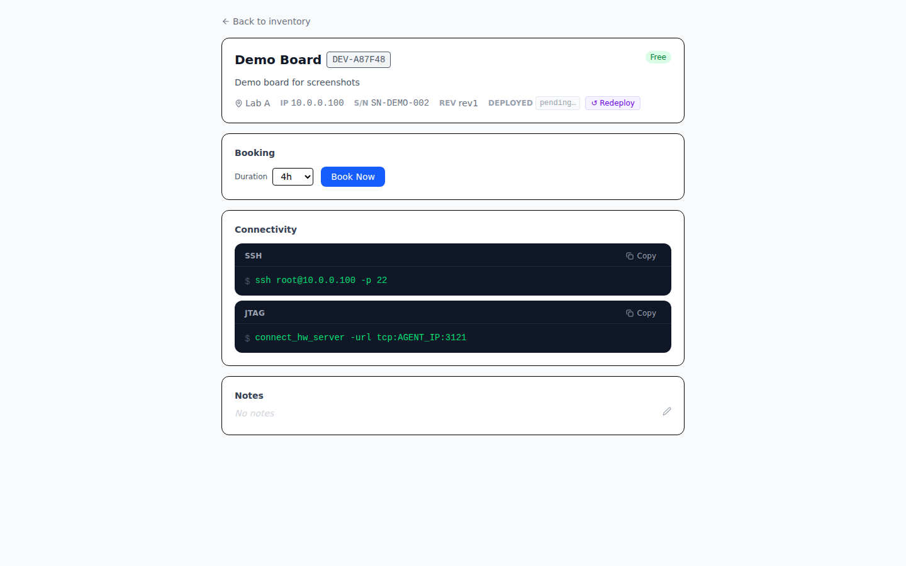
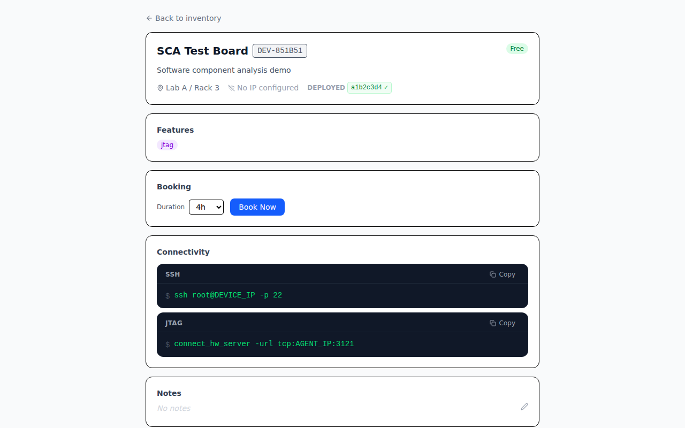
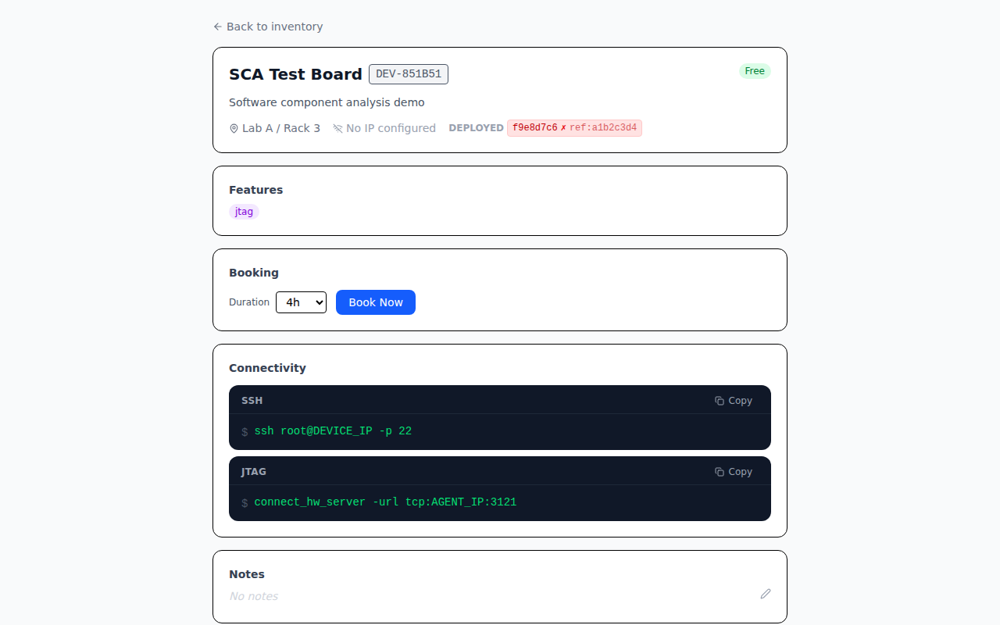
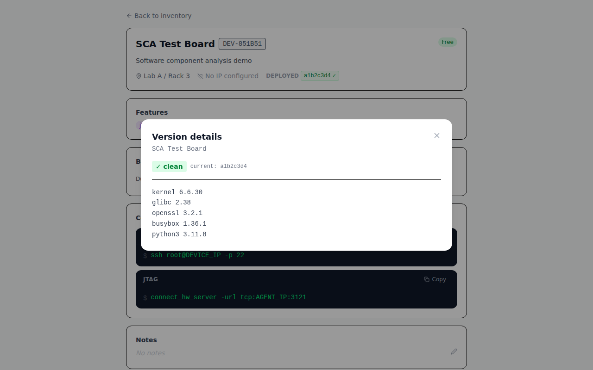
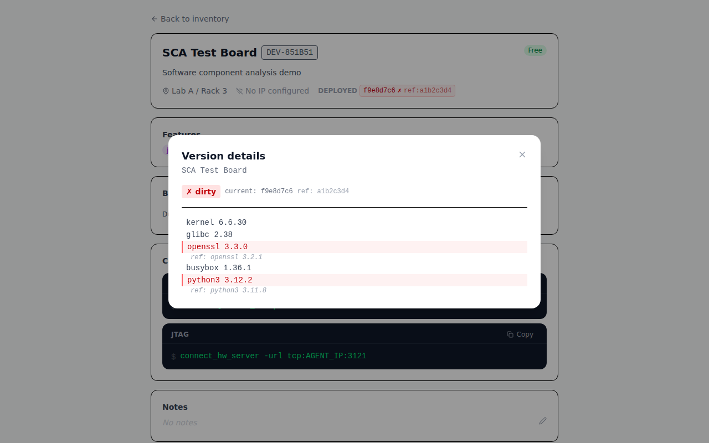
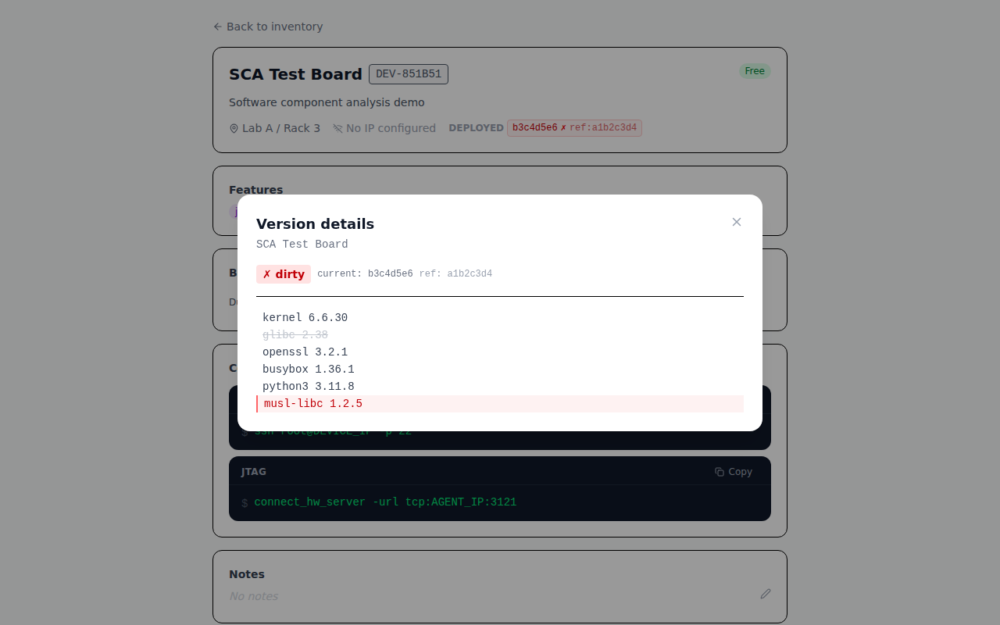

# Boardfarm

A development device booking and inventory system for shared hardware labs. Teams register physical devices (FPGAs, microcontrollers, SoCs, instruments) in a central server, book them by username, and get ready-to-run shell commands for SSH, UART, JTAG, and power control.

## Screenshots

| Inventory | Setups |
|-----------|--------|
|  |  |

| Device detail (version badge + Redeploy) | Booking history |
|------------------------------------------|----------------|
|  |  |

| Settings | Add Setup (device picker) |
|----------|--------------------------|
|  |  |

| Book Setup modal | Add device (agent + Version Control expanded) |
|-----------------|-----------------------------------------------|
|  |  |

### Version Control

When a device has a **Get Version Script Path** configured, the agent runs `check-version <get_script> <ref_file>` on a configurable interval and pushes the result to the server. The **DEPLOYED** badge in the device header shows:

- **`pending…`** (grey) — version script is set but the agent hasn't reported yet
- **`✓ clean`** (green) — deployed software matches the reference snapshot
- **`✗ dirty`** (red) — deployed software differs from the reference

Clicking the badge opens a detail modal. When a **Redeployment script path** is configured the **Redeploy** button appears inline next to the badge; clicking it runs the script through the agent and shows the result.

| Clean — matches reference | Dirty — packages diverged |
|--------------------------|--------------------------|
|  |  |

| Clean detail modal | Dirty detail modal (diff view) |
|-------------------|-------------------------------|
|  |  |

In the dirty diff view, lines that differ from the reference are **highlighted red** with the reference value shown in small italic text beneath each changed line.

The diff view also handles lines that appear or disappear entirely between the reference and the current snapshot:

| Added & removed lines |
|-----------------------|
|  |

- **Removed line** (`glibc 2.38`) — present in reference but absent from current: rendered as ~~red strikethrough~~ (consistent with the red theme; no "ref:" annotation since nothing replaced it).
- **Added line** (`musl-libc 1.2.5`) — present in current but absent from reference: rendered as a solid red line with no "ref:" annotation below (there is no reference value to compare against).

---

## Architecture

```
┌─────────────┐     REST/HTTP      ┌───────────────────────────┐
│  Frontend   │ ─────────────────> │  Server (central)         │
│ (React SPA) │                    │  - Device inventory       │
└─────────────┘                    │  - Booking history        │
                                   │  - Setup groups           │
                                   │  - Agent registry         │
                                   └───────────┬───────────────┘
                                               │ REST/HTTP
                                    ┌──────────┴──────────┐
                                    │  Agent(s)           │
                                    │  (per device-host)  │
                                    │  - hw_server JTAG   │
                                    │  - socat UART proxy │
                                    │  - Power control    │
                                    │  - SD card mux      │
                                    └─────────────────────┘
```

The **server** runs anywhere (lab server, developer laptop). It holds the device inventory and booking history and stays authoritative even when agents are offline.

Each **agent** runs natively on a host PC that is physically wired to one or more devices. It exposes hardware services (JTAG, UART, power, SD card) and registers itself with the server on startup.

---

## Repository layout

| Path | Description |
|------|-------------|
| `server/` | Central inventory & booking API (FastAPI, SQLite) |
| `agent/` | Hardware agent (FastAPI + mDNS) |
| `agent/scripts/` | Helper scripts installed to `/opt/boardfarm/agent/scripts/` (`sdcard-manager`, `check-version`, `access-control`) |
| `power/` | Power control scripts (USB relay, GPIO, dummy) |
| `frontend/` | React + Vite SPA |
| `user-scripts/` | Client-side helpers (`uart-connect`, `sdcard`) |
| `build-installer.sh` | Builds a self-contained offline agent installer tarball |

---

## Server setup

### Docker Compose (recommended for the server)

```bash
cp server/config.example.yaml server/config.yaml
docker compose up --build
```

| Container | Port | Description |
|-----------|------|-------------|
| `server` | 8765 | FastAPI booking API |
| `frontend` | 80 | Nginx serving the React SPA |

Open `http://localhost` in a browser. On first load it asks for the server URL — enter `http://localhost:8765`.

The SQLite database is stored in a named volume (`boardfarm_data`) and survives container restarts.

```bash
docker compose up -d --build      # run in background
docker compose logs -f server     # follow server logs
docker compose down               # stop
docker compose down -v            # stop + wipe database
```

### Manual server setup

```bash
# from repo root
pip install -r server/requirements.txt
cp server/config.example.yaml server/config.yaml
uvicorn server.main:app --port 8765
```

Key `server/config.yaml` options:

```yaml
server:
  token: ""              # empty = no auth required (fine for internal labs)
  max_booking_hours: 24  # cap per booking; null = unlimited; 0 = never expires
  default_user: null     # username pre-filled in every UI form
  admin_users:           # users that can release any booking / delete any device
    - "admin"
```

---

## Agent setup

The agent needs direct USB/serial device access — run it natively on the device-host PC, not in Docker.

### Production install (offline)

**Step 1 — build the package** on any machine with Python and internet:

```bash
./build-installer.sh
# → boardfarm-agent-YYYYMMDD.tar.gz

# Cross-architecture build (e.g. for an ARM host from an x86 machine):
./build-installer.sh --platform manylinux2014_aarch64
```

**Step 2 — transfer** the tarball to the target host (USB stick, SCP, etc.).

**Step 3 — install** on the target (no internet required):

```bash
tar xzf boardfarm-agent-YYYYMMDD.tar.gz
sudo boardfarm-agent/install.sh
```

The installer:
- Creates a `boardfarm` system user (added to `dialout` and `plugdev`)
- Installs a Python virtualenv at `/opt/boardfarm/agent/venv/` using only the bundled wheels
- Copies helper scripts to `/opt/boardfarm/agent/scripts/` (`sdcard-manager`, `check-version`, `access-control`)
- Writes `/opt/boardfarm/agent/config.yaml` from the example (skipped on re-run)
- Installs and enables the `boardfarm-agent` systemd service

**Step 4 — configure and start:**

```bash
sudo nano /opt/boardfarm/agent/config.yaml
sudo systemctl start boardfarm-agent
sudo journalctl -u boardfarm-agent -f
```

### Development setup (requires internet)

```bash
# from repo root
pip install -r agent/requirements.txt
cp agent/config.example.yaml agent/config.yaml
# edit agent/config.yaml
uvicorn agent.main:app --port 8766
```

---

## Agent config (`/opt/boardfarm/agent/config.yaml`)

```yaml
agent:
  name: "lab-host-1"
  port: 8766
  server_url: "http://192.168.1.100:8765"
  server_token: ""           # match server/config.yaml token
  agent_token: ""            # token this agent uses to authenticate with the server
  host_ip: "192.168.1.5"    # LAN IP of this machine (given to clients for SSH/JTAG/UART)

devices:
  - id: "paste-device-uuid-here"        # copy from the server's device detail page
    usb_device: "/dev/bus/usb/001/002"  # raw USB device path (optional)
    uart_device: "/dev/ttyUSB0"         # UART serial device (optional)
    jtag_port: 3121                     # hw_server listen port (optional)
    power_script: "/path/to/power/usb_relay.py"
    power_args:
      relay_id: 1
```

Apply changes: `sudo systemctl restart boardfarm-agent`

---

## Frontend (dev server)

```bash
cd frontend
npm install
npm run dev
# Open http://localhost:5173 — enter the server URL on first load
```

---

## User scripts (`user-scripts/`)

Client-side helpers for developers. Copy or symlink them into your `PATH`.

### `uart-connect`

Creates a local PTY and bridges it to the device's UART on the agent host over SSH.

```bash
uart-connect <agent_host> <uart_device> <device_id>

uart-connect vivado@192.168.1.5 /dev/ttyUSB0 DEV-A3F9C1
screen /dev/ttyDEV-A3F9C1
```

### `sdcard`

Mounts or unmounts a device's SD card locally via `sshfs`. Requires `sshfs` on the client.

```bash
sdcard <agent_host> <device_id> open|close

sdcard vivado@192.168.1.5 DEV-A3F9C1 open
# → SD card available at ~/sdcard-DEV-A3F9C1

sdcard vivado@192.168.1.5 DEV-A3F9C1 close
```

The device detail page shows all connectivity values pre-filled and offers a **Script** download button that generates a pre-configured version of both scripts for the selected device.

---

## Power control scripts (`power/`)

Shared CLI: `python3 script.py --action on|off|reset`

| Script | Hardware |
|--------|----------|
| `dummy.py` | No-op (testing) |
| `usb_relay.py` | USB HID relay (`--relay-id N`) |
| `gpio.py` | Raspberry Pi GPIO (`--gpio-pin N`) |

Custom controllers: subclass `power.base.PowerController`.

---

## Using the UI

> **No login required.** You supply your username when booking or modifying devices. It is stored in the browser and pre-filled in every form.

### Inventory (`/devices`)

Lists every registered device with live status:

- **Status badge** — Free (green), Booked (blue), Offline (amber), Disabled (grey)
- **Device ID** — auto-assigned short identifier (e.g. `DEV-A3F9C1`), shown as a monospace badge
- **Booked by** — current holder's username and booking comment
- **Features** — colour-coded capability badges (e.g. `jtag`, `fpga: zynq-7020`)
- **Actions** — Book · Release · Modify

Filter box searches name, device ID, location, username, or feature key.

**Add Device** form sections (collapsed by default):

- **Ethernet** — Device IP; enables SSH sub-section (SSH User, SSH Port)
- **Hardware agent** — **Self hosted** checkbox (agent runs on the device itself) or **Hardware agent IP** field when unchecked; capability sub-sections:
  - **USB** — USB device path
  - **UART** — UART device path
  - **JTAG** — JTAG port (default `3121`)
  - **SDMux** — SDMux control device (default `/dev/sg0`) and SD card path
  - **Power Control** — power script path and args
  - **Access Control** — path to the access control script (default `/opt/boardfarm/agent/scripts/access-control`); run with `unlock` on booking and `lock` on release
  - **Version Control** — **Get Version Script Path**, **Reference Version File Path**, **Check interval (seconds)**, **Redeployment script path**; the agent polls the version script and shows a badge; a Redeploy button appears on the device detail page when a redeployment script is set

Each enabled sub-section automatically adds the matching key to the device's Features map.

### Device detail (`/devices/:id`)

- **Hardware info** — device ID, serial number, revision, location, IP addresses, agent status; **DEPLOYED** badge shows `pending…` / `✓ clean` / `✗ dirty` when a version script is configured; **Redeploy** button triggers the redeployment script through the agent
- **Features** — key/value capability map
- **Connectivity** — ready-to-run shell commands with **Copy** and **Script** (download) buttons:

  | Service | Command |
  |---------|---------|
  | SSH | `ssh -J vivado@<agent_ip> <user>@<device_ip> -p <port>` — "Through agent" checkbox (on by default) toggles the `-J` jump host |
  | UART | `sudo socat pty,link=/dev/ttyDEV-XXXX,rawer EXEC:"ssh vivado@<agent_ip> socat - /dev/ttyUSB0,rawer"` |
  | JTAG | `connect_hw_server -url tcp:<agent_ip>:<jtag_port>` |
  | Power | `python3 <power_script> --action on` |
  | SD Card | downloadable `sdcard` script pre-configured for this device |

- **Notes** — freeform notes, editable inline
- **Booking** — book / extend / release with a live countdown timer

### Setups (`/setups`)

Groups of devices used together (e.g. "FPGA + logic analyzer + test host").

- **Atomic booking** — all devices reserved in one transaction; fails with a blocking-device list if any are unavailable
- **Atomic release** — releases all devices at once
- Per-device availability dot: green = free, blue = booked, grey = offline

### History (`/history`)

Full audit log: bookings, releases, extensions, device adds/edits/deletes. Filter by username or action category.

---

## API reference

### Authentication

| Request | `X-User` | `X-Token` |
|---------|----------|-----------|
| `GET` (read) | not required | not required |
| `POST` / `PATCH` / `DELETE` | **required** | required only if `token` set in server config |

### Server endpoints (`http://server:8765`)

**Devices**

| Method | Path | Description |
|--------|------|-------------|
| GET | `/devices` | List all devices with live status |
| GET | `/devices/{id}` | Device detail + active booking |
| POST | `/devices` | Add device (`device_id` auto-assigned) |
| PATCH | `/devices/{id}` | Update device metadata |
| DELETE | `/devices/{id}` | Remove device (fails if actively booked) |

**Bookings**

| Method | Path | Description |
|--------|------|-------------|
| POST | `/devices/{id}/book` | Book a device `{duration_hours, comment}` |
| DELETE | `/bookings/{id}` | Release booking |
| PATCH | `/bookings/{id}/extend` | Extend by N hours (once per booking) |
| GET | `/bookings/{id}/commands` | SSH / UART / JTAG / power command strings |
| GET | `/bookings` | History (`device_id`, `username`, `active`, `limit`) |

**Setups**

| Method | Path | Description |
|--------|------|-------------|
| GET | `/setups` | List all setups with device availability |
| POST | `/setups` | Create setup `{name, description, device_ids}` |
| PATCH | `/setups/{id}` | Update name / description / device list |
| DELETE | `/setups/{id}` | Delete setup (fails if actively booked) |
| POST | `/setups/{id}/book` | Book all devices atomically `{duration_hours, comment}` |
| DELETE | `/setups/{id}/booking` | Release all devices in the setup |

**Agents & activity**

| Method | Path | Description |
|--------|------|-------------|
| GET | `/agents` | List registered agents (online / offline) |
| POST | `/agents/register` | Agent startup registration |
| POST | `/agents/heartbeat` | Agent keep-alive (every 30 s) |
| GET | `/activity` | Audit log (`device_ref`, `username`, `action`, `limit`) |
| GET | `/health` | Liveness check + server config |

### Agent endpoints (`http://agent:8766`)

| Method | Path | Description |
|--------|------|-------------|
| GET | `/health` | Liveness + version |
| GET | `/devices` | Devices managed by this agent |
| POST | `/devices/{id}/services/start` | Start hw_server + UART proxy (runs access-control unlock) |
| POST | `/devices/{id}/services/stop` | Stop hw_server + UART proxy (runs access-control lock) |
| POST | `/devices/{id}/power` | Power action `{action: on\|off\|reset}` |
| POST | `/devices/{id}/redeploy` | Run the device's redeployment script (proxied via server) |

---

## Device fields

| Field | Type | Notes |
|-------|------|-------|
| `id` | UUID | Stable across agent changes |
| `device_id` | string | Auto-assigned short ID (e.g. `DEV-A3F9C1`) |
| `name` | string | Human-readable name, unique |
| `serial_number` | string | Hardware serial (optional) |
| `revision` | string | PCB revision (optional) |
| `description` | string | Free text |
| `location` | string | Physical location (e.g. `Lab A / Rack 3 / Slot 1`) |
| `device_ip` | string | Device's own IP (SSH target) |
| `host_ip` | string | Agent host PC IP (JTAG / UART / power / SD card) |
| `ssh_user` / `ssh_port` | string / int | SSH credentials (default `root` / `22`) |
| `usb_device` | string | Raw USB path on agent host (e.g. `/dev/bus/usb/001/002`) |
| `uart_device` | string | UART serial device on agent host (e.g. `/dev/ttyUSB0`) |
| `jtag_port` | int | hw_server port (default `3121`) |
| `power_script` | string | Absolute path to power control script on agent host |
| `sdmux_control` | string | SDMux control device on agent host (e.g. `/dev/sg0`) |
| `sdmux_sdcard` | string | SD card block device (e.g. `/dev/disk/by-path/...`) |
| `access_control_script` | string | Path to access control script on agent host (default `/opt/boardfarm/agent/scripts/access-control`); called with `unlock` on booking and `lock` on release |
| `version_script` | string | Absolute path to the "get version" script on the agent host (e.g. `/opt/sca/get-version.sh`) |
| `version_ref_file` | string | Absolute path to the reference snapshot file (e.g. `/opt/sca/ref-version.txt`) |
| `version_poll_interval` | int | Seconds between version checks; `0` = agent default |
| `redeployment_script` | string | Absolute path to the redeployment script; enables the **Redeploy** button on the device detail page |
| `features` | JSON | Key/value capability map; auto-populated from enabled hardware options |
| `enabled` | bool | Disabled devices cannot be booked |
