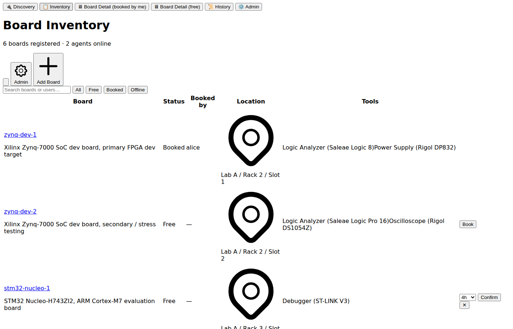
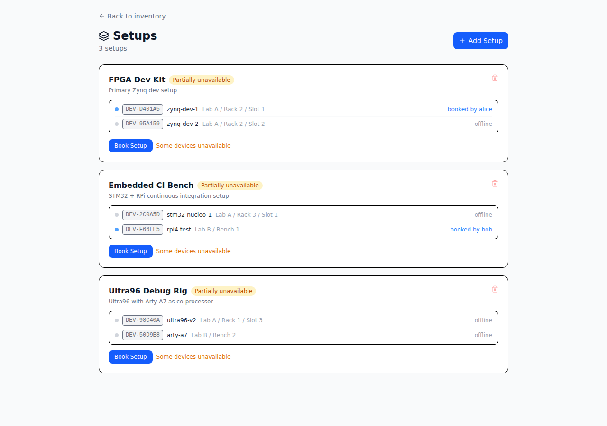
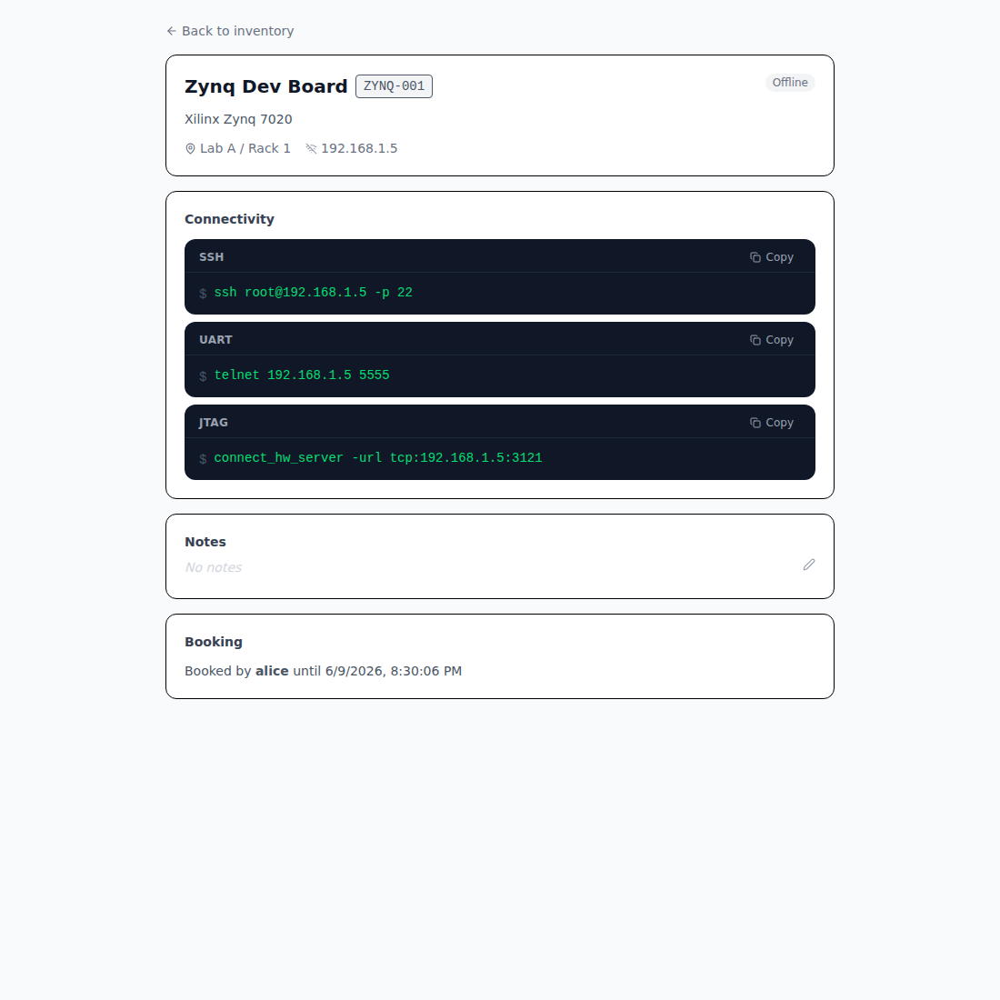
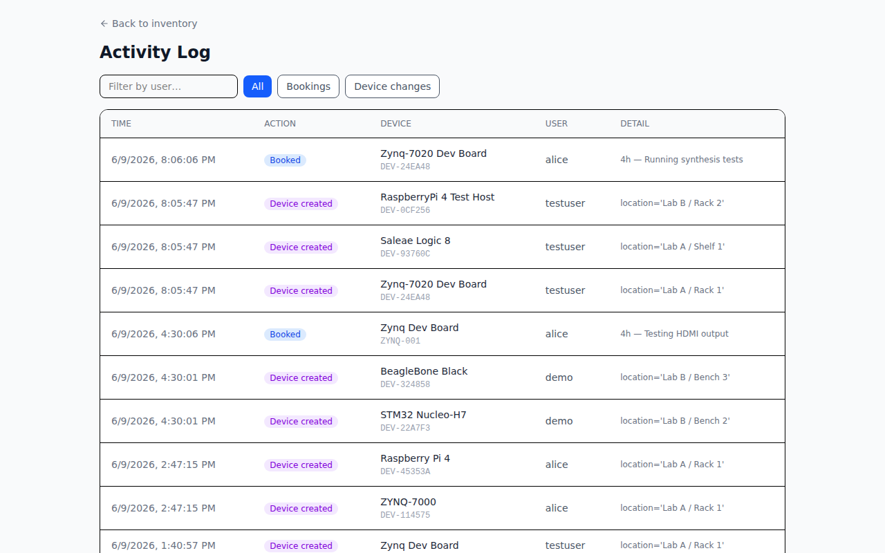
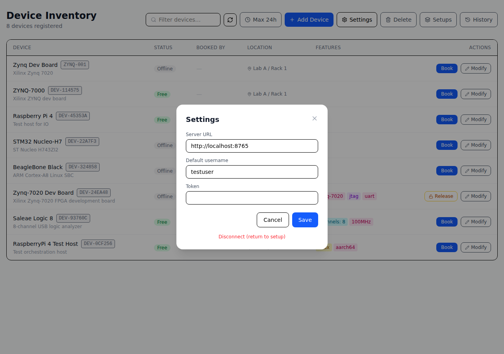
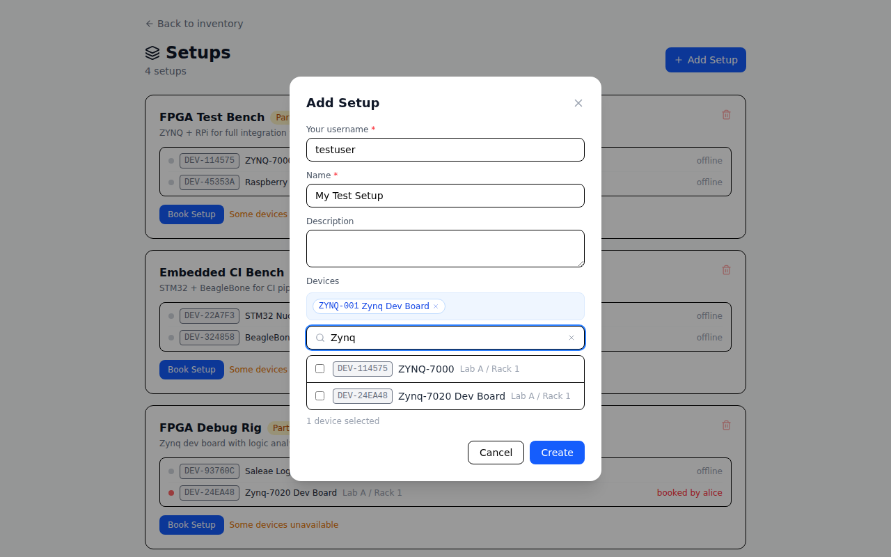
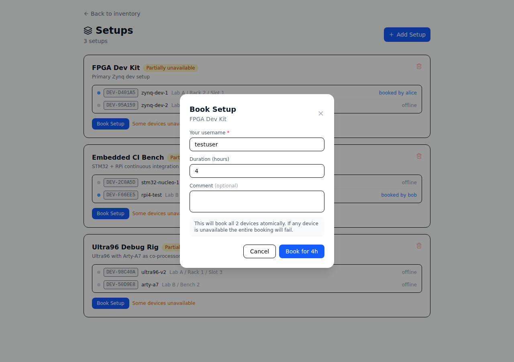
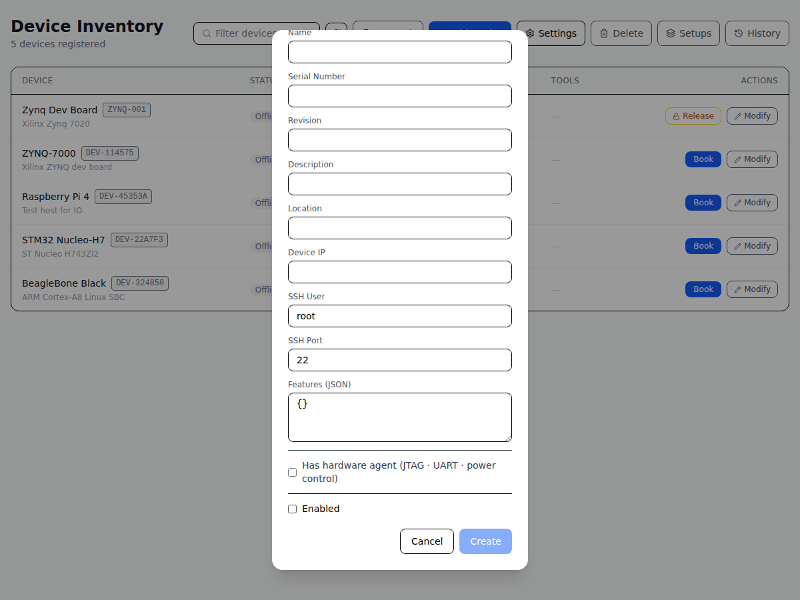

# Boardfarm

A development device booking and inventory system for shared hardware labs. Teams register physical devices (FPGAs, microcontrollers, SoCs, instruments) in a central server, book them by username, and get ready-to-run shell commands for SSH, UART, JTAG, and power control.

## Architecture

```
┌─────────────┐     REST/HTTP      ┌───────────────────────────┐
│  Frontend   │ ─────────────────> │  Server (central)         │
│ (React SPA) │                    │  - Device inventory       │
└─────────────┘                    │  - Booking history        │
                                   │  - Setup groups           │
                                   │  - Agent registry         │
                                   └───────────┬───────────────┘
                                               │ REST/HTTP
                                    ┌──────────┴──────────┐
                                    │  Agent(s)           │
                                    │  (per device-host)  │
                                    │  - hw_server JTAG   │
                                    │  - socat UART proxy │
                                    │  - Power control    │
                                    └─────────────────────┘
```

## Repository layout

| Directory | Description |
|-----------|-------------|
| `server/` | Central inventory & booking API (FastAPI, SQLite) |
| `agent/`  | Hardware agent per device-host PC (FastAPI + mDNS) |
| `power/`  | Power control scripts (USB relay, GPIO, dummy) |
| `frontend/` | React + Vite SPA |

---

## Quick Start

### Docker Compose (recommended)

```bash
cp server/config.example.yaml server/config.yaml
docker compose up --build
```

| Container  | Port | Description |
|------------|------|-------------|
| `server`   | 8765 | FastAPI booking API |
| `frontend` | 80   | Nginx serving the React SPA |

Open `http://localhost` and enter `http://localhost:8765` as the server URL.

The SQLite database is stored in a named volume (`boardfarm_data`) and persists across restarts.

```bash
docker compose up -d --build      # background
docker compose logs -f server     # follow server logs
docker compose down               # stop
docker compose down -v            # stop + delete DB
```

---

### Manual setup

#### Server

```bash
cd server
pip install -r requirements.txt
cp config.example.yaml config.yaml
uvicorn server.main:app --port 8765
```

Key `config.yaml` options:

```yaml
server:
  token: ""              # empty = no token required (fine for internal labs)
  max_booking_hours: 24  # N = cap in hours, null = unlimited, 0 = never expires
  default_user: null     # username pre-filled in every form (null = none)
  admin_users:           # can release any booking and delete any device
    - "admin"
```

#### Agent (on the host PC wired to devices)

The agent needs direct access to USB/serial devices — run it natively, not in Docker.

```bash
cd agent
pip install -r requirements.txt
cp config.example.yaml config.yaml
# Edit: server_url, server_token, host_ip, device IDs
uvicorn agent.main:app --port 8766
```

#### Frontend (dev server)

```bash
cd frontend
npm install
npm run dev
# Open http://localhost:5173 and enter the server URL
```

---

## Agent config (`agent/config.yaml`)

```yaml
agent:
  name: "lab-host-1"
  port: 8766
  server_url: "http://192.168.1.100:8765"
  server_token: ""           # match server/config.yaml token
  agent_token: ""            # token agents use to authenticate with server
  host_ip: "192.168.1.5"    # this machine's LAN IP

boards:
  - id: "paste-device-uuid-here"
    usb_device: "/dev/bus/usb/001/002"  # raw USB device (optional)
    uart_device: "/dev/ttyUSB0"         # UART serial device (optional)
    jtag_port: 3121                     # hw_server port (optional)
    power_script: "../power/usb_relay.py"
    power_args:
      relay_id: 1
```

---

## Power control scripts

Scripts in `power/` share a CLI: `python3 script.py --action on|off|reset`.

| Script | Hardware |
|--------|----------|
| `dummy.py` | No-op (for testing) |
| `usb_relay.py` | USB HID relay board (`--relay-id N`) |
| `gpio.py` | Raspberry Pi GPIO (`--gpio-pin N`) |

Custom controllers: subclass `power.base.PowerController`.

---

## Screenshots

| Inventory | Setups |
|-----------|--------|
|  |  |

| Device detail (shell commands) | Booking history |
|-------------------------------|----------------|
|  |  |

| Settings | Add Setup (device picker) |
|----------|--------------------------|
|  |  |

| Book Setup modal | Add device (agent section expanded) |
|-----------------|-------------------------------------|
|  |  |

---

## Using the UI

> **No login required.** You supply your username when performing an action (book, release, add). A default username is stored locally in the browser and pre-filled in every form.

### Inventory (`/devices`)

Lists every registered device with live status:

- **Status badge** — Free (green), Booked (blue), Offline (amber), Disabled (grey)
- **Device ID** — server-assigned unique identifier (e.g. `DEV-A3F9C1`), shown as a monospace badge next to the device name
- **Booked by** — current holder's username and booking comment
- **Location** — physical rack/bench location
- **Features** — colour-coded badges for device capabilities (e.g. `jtag: true`, `fpga: zynq-7020`)
- **Actions** — Book · Release · Modify

The **Filter** box searches by device name, device ID, location, username, or feature key.

**Add Device** form sections, all collapsed by default:

- **Ethernet** — reveals Device IP, then SSH sub-checkbox (on by default):
  - **SSH** — reveals SSH User, SSH Port
- **Has hardware agent** — reveals Agent Host IP and capability sub-checkboxes (all off by default):
  - **USB** — reveals USB device path (e.g. `/dev/bus/usb/001/002`)
  - **UART** — reveals UART device path (e.g. `/dev/ttyUSB0`)
  - **JTAG** — reveals JTAG Port
  - **Power Control** — reveals Power Script, Power Script Args

### Device detail (`/devices/:id`)

Each device has a detail page with:

- **Hardware info** — device ID, serial number, PCB revision, location, IP addresses, USB device path, agent status
- **Features** — arbitrary key/value capability map (e.g. `jtag: true`)
- **Connectivity** — ready-to-run shell commands, each in its own terminal block with a **Copy** button:

  | Service | Command |
  |---------|---------|
  | SSH | `$ ssh root@<device_ip> -p <port>` |
  | UART | `$ sudo socat pty,link=/dev/ttyDEV-XXXX,rawer EXEC:"ssh vivado@<agent_ip> socat - /dev/ttyUSB0,rawer"` |
  | JTAG | `$ connect_hw_server -url tcp:<agent_ip>:<jtag_port>` |
  | Power | `$ python3 <power_script> --action on` |

- **Notes** — freeform notes, editable inline
- **Booking** — book / extend / release with a live countdown timer

When you have an active booking, a **Connection Commands** section appears at the bottom with the full command set for that booking (including Vivado TCL).

### Setups (`/setups`)

Groups of devices that are always used together (e.g. "FPGA + logic analyzer + test host").

- **Book atomically** — all devices in a setup are reserved in a single transaction. If any device is already taken the whole booking fails, with a message listing which devices are blocked and by whom.
- **Release atomically** — releases all devices in the setup at once.
- **Device picker** — searchable by name, device ID, or location. Selected devices appear as removable chips so the list stays short at scale.
- Each setup card shows a per-device availability dot: green = free and online, blue = booked, grey = offline.

### Booking history (`/history`)

Full audit log of all actions: bookings, releases, extensions, device creates/updates/deletes. Each entry records the device name and its auto-assigned device ID, so records stay meaningful after renames.

Filter by user or action category (Bookings / Device changes).

---

## API reference

### Authentication

| Request | `X-User` | `X-Token` |
|---------|----------|-----------|
| `GET` (read) | not required | not required |
| `POST` / `PATCH` / `DELETE` (write) | **required** | required only if `token` is set in config |

### Server endpoints (`http://server:8765`)

**Devices**

| Method | Path | Description |
|--------|------|-------------|
| GET | `/devices` | List all devices with live status |
| GET | `/devices/{id}` | Device detail + active booking |
| POST | `/devices` | Add device (`device_id` is auto-assigned by server) |
| PATCH | `/devices/{id}` | Update device metadata |
| DELETE | `/devices/{id}` | Remove device (fails if actively booked) |

**Bookings**

| Method | Path | Description |
|--------|------|-------------|
| POST | `/boards/{id}/book` | Book a single device `{duration_hours, comment}` |
| DELETE | `/bookings/{id}` | Release booking (admin can release any) |
| PATCH | `/bookings/{id}/extend` | Extend by N hours (once per booking) |
| GET | `/bookings/{id}/commands` | SSH / UART / JTAG / power command strings |
| GET | `/bookings` | Booking history (`board_id`, `username`, `active`, `limit`) |

**Setups**

| Method | Path | Description |
|--------|------|-------------|
| GET | `/setups` | List all setups with device availability |
| POST | `/setups` | Create setup `{name, description, board_ids}` |
| PATCH | `/setups/{id}` | Update name / description / device list |
| DELETE | `/setups/{id}` | Delete setup (fails if actively booked) |
| POST | `/setups/{id}/book` | Book all devices atomically `{duration_hours, comment}` |
| DELETE | `/setups/{id}/booking` | Release all devices in the setup |

**Agents & activity**

| Method | Path | Description |
|--------|------|-------------|
| GET | `/agents` | List registered agents (online / offline) |
| POST | `/agents/register` | Agent startup registration |
| POST | `/agents/heartbeat` | Agent keep-alive (every 30 s) |
| GET | `/activity` | Audit log (`board_id`, `username`, `action`, `limit`) |
| GET | `/health` | Liveness check + server config |

### Agent endpoints (`http://agent:8766`)

| Method | Path | Description |
|--------|------|-------------|
| GET | `/health` | Liveness + version |
| GET | `/boards` | Devices managed by this agent |
| POST | `/boards/{id}/services/start` | Start hw_server + UART proxy |
| POST | `/boards/{id}/services/stop` | Stop services |
| POST | `/boards/{id}/power` | Power action `{action: on\|off\|reset}` |

---

## Device fields

| Field | Type | Notes |
|-------|------|-------|
| `id` | UUID | Stable across agent changes |
| `device_id` | string | Auto-assigned by server on creation (e.g. `DEV-A3F9C1`) |
| `name` | string | Human-readable name, unique |
| `serial_number` | string | Hardware serial (optional) |
| `revision` | string | PCB revision (optional) |
| `description` | string | Free text |
| `location` | string | Physical location (e.g. `Lab A / Rack 3 / Slot 1`) |
| `device_ip` | string | Device's own IP address (SSH target) |
| `host_ip` | string | IP of the agent's host PC (JTAG / UART / power) |
| `ssh_user` / `ssh_port` | string / int | SSH access (shown when Ethernet + SSH enabled) |
| `usb_device` | string | Raw USB device path on agent host (e.g. `/dev/bus/usb/001/002`) |
| `uart_device` | string | UART serial device path on agent host (e.g. `/dev/ttyUSB0`) |
| `jtag_port` | int | hw_server port |
| `power_script` | string | Path to power control script |
| `features` | JSON | Arbitrary key/value capability map |
| `enabled` | bool | Disabled devices cannot be booked |
